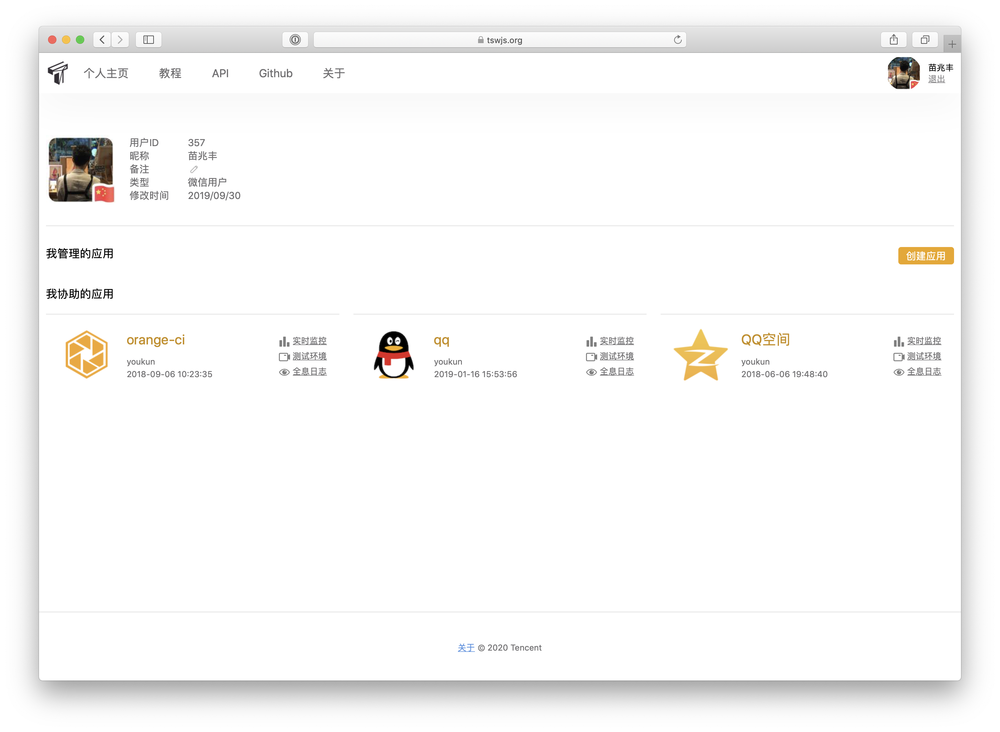
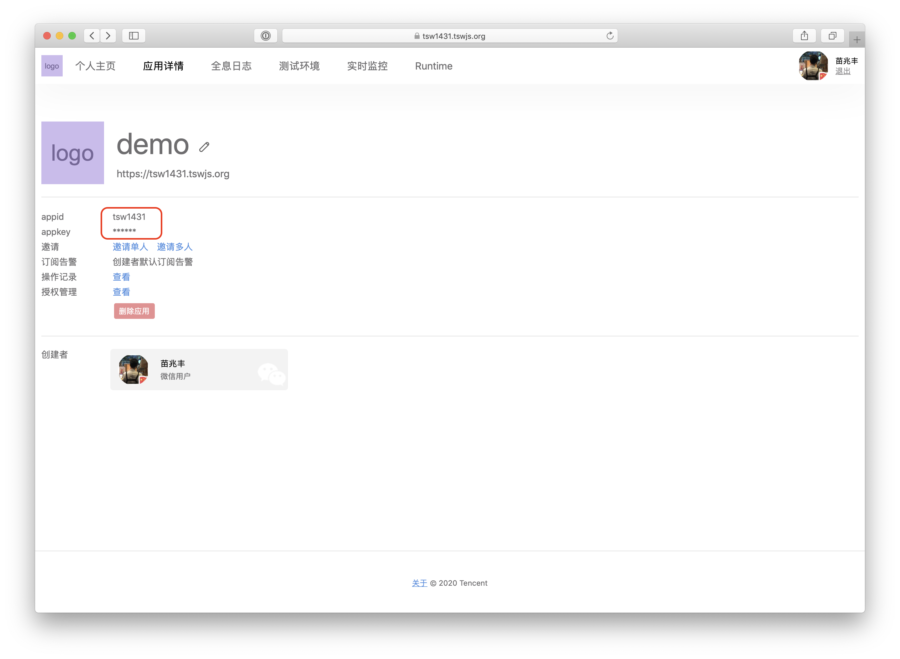
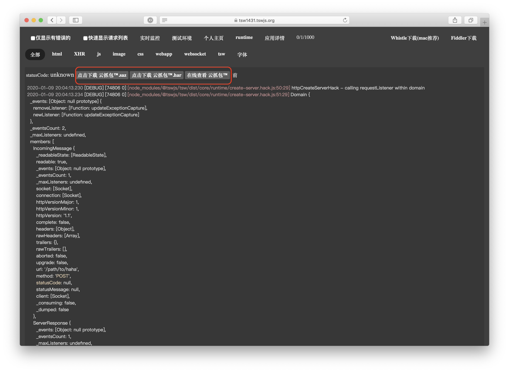
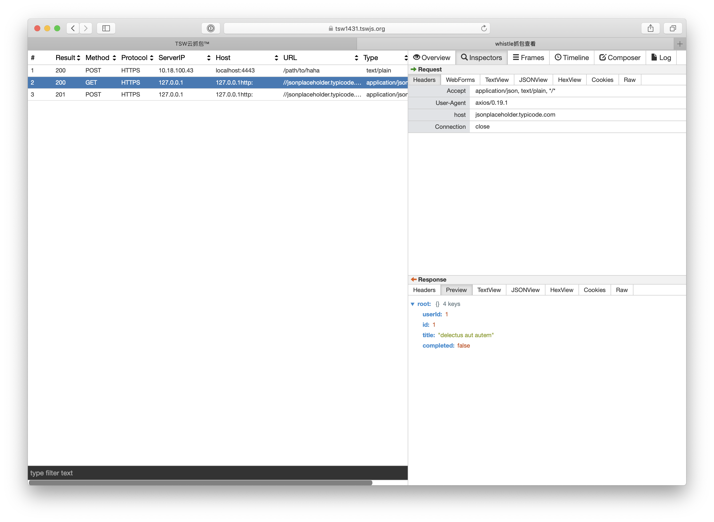

# [Tencent Server Web 2.0](https://tswjs.org)


[](https://github.com/Tencent/TSW/blob/master/LICENSE) [](https://github.com/Tencent/TSW/actions?query=workflow%3Abuild) [](https://github.com/facebook/jest)

2.0 进度参见：https://github.com/Tencent/TSW/projects

<h2 align="center">What is it</h2>

Tencent Server Web(TSW) 是一套面向 WEB 前端开发者，以提升问题定位效率为初衷，提供**染色抓包**、**全息日志**和**异常发现**的 Node.js 基础设施。TSW 关注业务的运维监控能力，适用于 http、websocket 协议的业务场景，可无缝与现有应用（Koa、Express）进行整合。

TSW 2.0 是在 1.0 的基础上抽丝剥茧，辅以现代化的设计模式演化而来，去除了 1.0 中的大量糟粕，同时对容器化、云原生更加友好。做到了无侵入、低成本接入。

<h2 align="center">Highlights</h2>

<table>
  <tr>
    <th><h4 align="center">🚀<h4 align="center">~0 侵入</h4 align="center"></th>
    <th><h4 align="center">🗡️</h4 align="center"><h4 align="center">定位问题如手术刀般犀利</h4 align="center"></th>
  </tr>
  <tr>
    <td width="33%"><sub>通过 Hack NodeJS 底层代码实现抓包、全息日志功能。对原有业务代码几乎零侵入。</sub></td>
    <td width="33%"><sub>TSW 提供了显微镜级别的全息日志，给开发者以完美的现场还原。可以重现每一个请求现场。一秒定位问题。</sub></td>
  </tr>
</table>

<h2 align="center">Quick Start</h2>

首先，通过 npm 或者 yarn 安装 npm 包，`npm install --save @tswjs/tsw` or `yarn add @tswjs/tsw`。

原本通过 `node ./index.js` 方式启动的应用，更换为 `npx @tswjs/tsw ./index.js`。

### Examples

我们提供了一些示例项目以让大家尽快了解该项目。

1. `cd ~`
2. `git clone https://github.com/Tencent/TSW.git`
3. `cd TSW`

#### Koa

1. `cd examples/koa`
1. `yarn`
1. `yarn serve` 或者 `npm run serve`
1. `curl -v localhost:4443/path/to/foo -X POST -d "hello, server"`

#### 使用 https://tswjs.org 开放平台

在默认的情况下，TSW 只是会把所有的日志和抓包内容抓取到并且送到事件总线上，以供 [插件](#插件是什么？) 消费。所以将日志和抓包内容落地查看一般需要用户自己编写插件以及提供存储，使用成本过于高昂。因此，TSW 官方提供了公共的服务平台，以供用户以更成本、更快、更方便地使用 TSW 的特性。使用方式如下：

1. 登录 https://tswjs.org 并在其上新建一个应用



1. 打开应用，获取 `appid` 和 `appkey`



1. 在项目根目录下新增配置文件 `tswconfig.json`，并将 `appid` 和 `appkey` 配置完成

```json
{
  "appid": "your-app-id",
  "appkey": "your-app-key",
  "plugins": [
    "@tswjs/open-platform-plugin"
  ]
}
```

1. 向之前启动的 Koa 或者原生 http server 发送请求，并且在开放平台上查看对应的日志和抓包。查看地址为下方地址拼接而成 `https://domain/log/view/demo`


**日志记录**



**在线查看抓包内容**




<h2 align="center">Plugins</h2>

### 插件是什么？

TSW 核心的实现方式是 Hack NodeJS 自身的 `http.request` 以及 `http.createServer`， 以此来实现抓包机制。在服务器处理请求的前后，在服务器向其他服务器发包的前后，等等，都会有相应的事件抛出，以供用户来进行自定义处理。**为了让用户更加方便地复用、传播这样一组组自定义处理，我们将他们抽象出来，形成了插件机制。**

### 一个最简单的插件

```js
export.modules = class MyPlugin() {
  constructor() {
    this.name = "MyPlugin"
  }

  async init(eventBus, config) {
    eventBus.on("RESPONSE_CLOSE", (payload) => {
      console.log(payload);
    })
  }
}
```

`init` 方法是必须的，这个方法在插件加载开始时会被调用，可以是同步也可以是异步。

#### `eventBus`

`eventBus` 是通过 `new EventEmitter()` 得到的。TSW 核心会在各个关键时机触发上面的事件。

| key | 含义（触发时机） | payload |
| -- | -- | -- |
| `DNS_LOOKUP_SUCCESS` | 在每次 DNS 查询成功之后触发 | `string | dns.LookupAddress[]` |
| `DNS_LOOKUP_ERROR` | 在每次 DNS 查询失败之后触发 | `NodeJS.ErrnoException` |
| `RESPONSE_START` | 在每次服务器开始返回响应（执行 `writeHead`）时触发 | `ResponseEventPayload` |
| `RESPONSE_FINISH` | 在响应结束时（`res.on("finish")`）触发 | `ResponseEventPayload` |
| `RESPONSE_CLOSE` | 在底层链接关闭时 （`res.on("close")`）触发 | `ResponseEventPayload` |
| `REQUEST_START` | 在每次服务器接受到新的请求时触发 | `RequestEventPayload` |

#### `config`

`config` 是用户的自定义配置。一个简单的配置文件如下：

```js
module.exports = {
  plugins: [
    new MyPlugin({})
  ]
}
```

### 配置文件

| key | 必传 | 类型 | 含义 | 
| -- | -- | -- | -- |
| plugins | 否 | `new Plugin[]` | 插件列表 |

<h2 align="center">License</h2>

Tencent Server Web 的开源协议为 MIT, 详情参见 [LICENSE](https://github.com/Tencent/TSW/blob/master/LICENSE) 。
